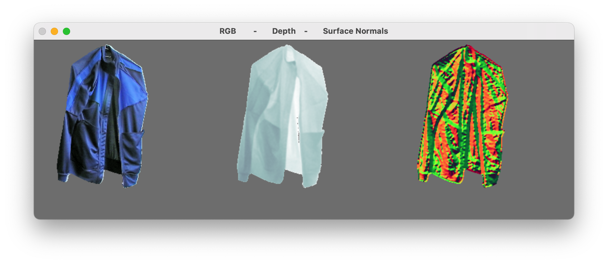

# Capturing RGB-D Data with a Kinect v2 device

This repository contains source code for using a Microsoft Kinect device to capture synchronised RGB images and
corresponding depth maps and surface normals.

## Installation

The source code was written in Python 3.9.6 and tested on macOS Big Sur 11.5.1. It requires the following packages:

- `numpy`
- `cython`
- `opencv-python`

These can be installed with `pip`. Using a virtualenv is recommended, e.g., by running the following commands in project
directory:

```
python3 -m venv venv
pip install --upgrade pip
pip install -r requirements.txt
```

Additionally, it also requires [`pylibfreenect2`](https://github.com/r9y9/pylibfreenect2), a Python wrapper
of [`libfreenect2`](https://github.com/OpenKinect/libfreenect2) which is an open-source driver for the Kinect for
Windows v2 device. For this,
follow [these installation instructions](http://r9y9.github.io/pylibfreenect2/stable/installation.html).

## Supported Devices

This code only works with the following Kinect v2 devices:

- Kinect for Windows v2
- Kinect for Xbox One

This is because `libfreenect2` does not support older devices.

**NOTE:** If you have a Kinect for Windows v1 or a Kinect for Xbox 360 sensor, you may still be able to adapt the code
by using [`libfreenect`](https://github.com/OpenKinect/libfreenect) instead.

### [Kinect v2](https://docs.depthkit.tv/docs/kinect-for-windows-v2)

Kinect for Windows V2 and Kinect for Xbox One are identical in how they function, with similar specifications which are
relevant for capturing synchronized RGB-D images.

#### Depth Sensor

The Kinect is a [time-of-flight camera](https://en.wikipedia.org/wiki/Time-of-flight_camera) which uses infrared light
to sense the distance between the camera and the subject for each point in the image. This IR data can be used to create
depth maps.

The depth sensor has a range of around 0.5m and 4.5m. It has a resolution of 512 x 424 pixels with a field of view (FoV)
of 70.6° x 60°, resulting in an average of around 7 x 7 depth pixels per degree

#### Color Sensor

The Kinect also has a regular RGB camera sensor. It has a resolution of 1920 x 1080px with a FoV of 84.1° x 53.8°,
resulting in an average of about 22 x 20 color pixels per degree.

_**Important:** Due to different FoVs, the depth and color sensors do not see exactly the same views, and need to be
aligned._

## Aligning Depth and Color Images

The color image has a much larger horizontal range, whereas the depth image has a slightly larger vertical range. This
means that the points in the two images do not correspond directly to each other. They can be roughly aligned by
cropping some width of the color image, and some height of the depth image.

For more details, see the `align_frames` function in [`kinect.py`](src/kinect.py).

## Getting the RGB-D images

Connect the Kinect device to your computer, and then run the `main.py` script. It should open a window showing a
livestream of color, depth and normal images side-by-side.



In the `main.py` script, each frame of the captured RGB-D and normals data is accessible in the `save_frame` function. This includes the following:

| Variable | Description                                        |     Range      |     Shape     |
| -------- | :------------------------------------------------- | :------------: | :-----------: |
| `color`  | The RGB image.                                     | 0.0 - 255.0    | 512 x 373 x 3 |
| `depth`  | The corresponding grayscale depth map.             | 700.0 - 1250.0 | 512 x 373 x 1 |
| `norms`  | Surface normals as 3D unit vectors for each pixel. | 0.0 - 1.0      | 512 x 373 x 3 |

from where you can save it to files on your computer if needed.

**NOTE:** The depth map output has values in range 0.7-1.25 m, even though the sensor can capture depth between 0.5-4.5 m. This is so that we can place our subject 0.7-1.25 m away from the camera, and everything further than 1.25 m is considered as background. It allows us to capture only the subject, with background as all zeros.

To change this behavior, edit the following line:
```
mask = np.logical_or(depth > 1250, depth < 700)
```
in the `frame_listener` function in [`main.py`](src/main.py).
